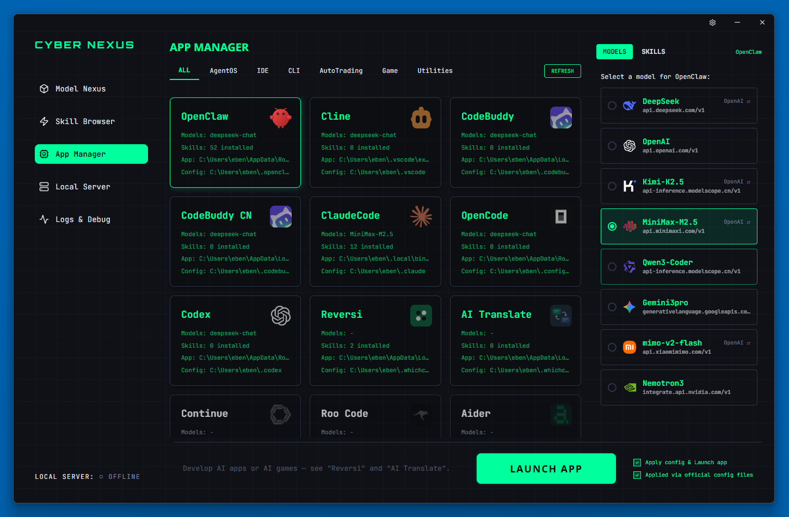
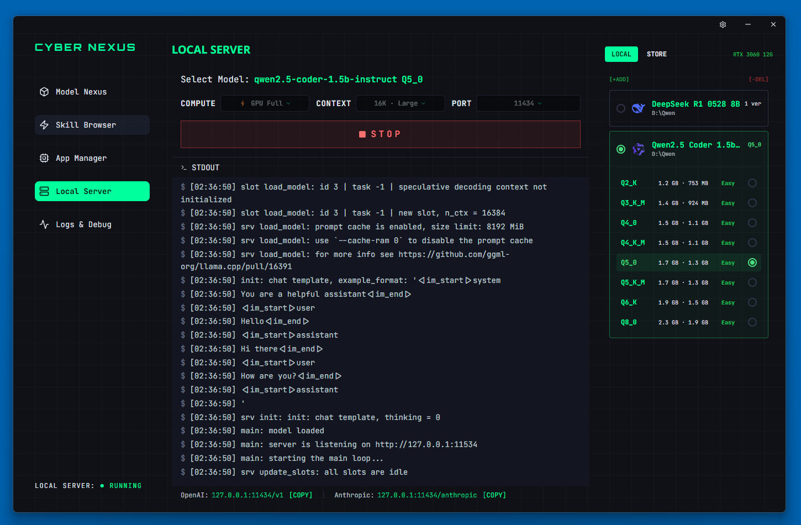
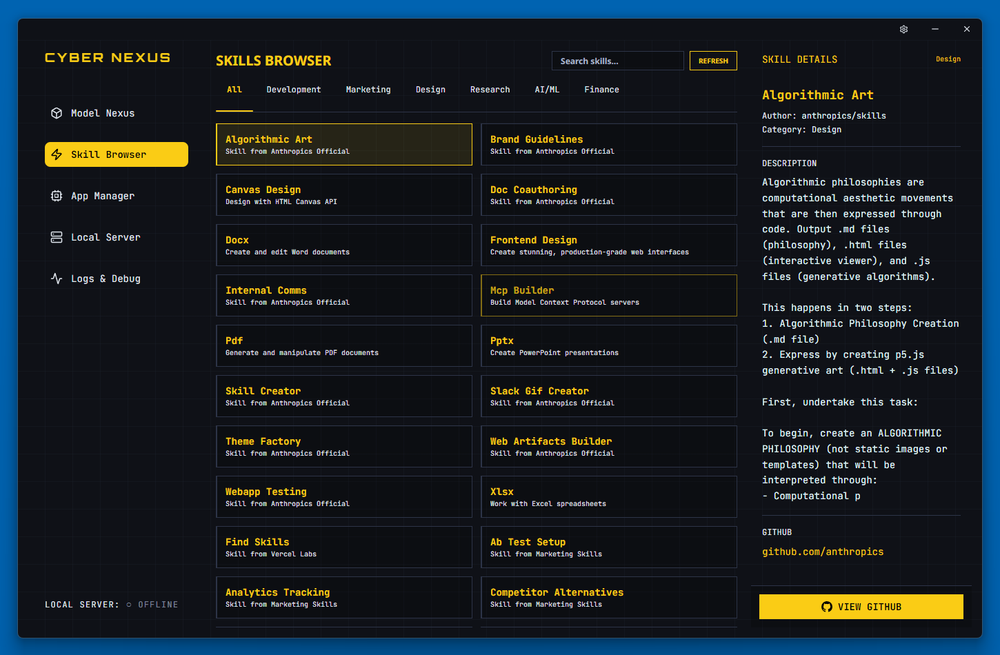

<p align="center">
  
</p>

<h1 align="center">WhichClaw</h1>

<p align="center">
  <strong>One Hub. All Models. Every Coding Tool.</strong><br/>
  <sub>Киберпанк-панель управления для эпохи ИИ.</sub>
</p>

<p align="center">
  <a href="https://github.com/WhichClawTeam/WhichClaw/releases">
    
  </a>
  
  
</p>

<p align="center">
  <a href="../README.md">English</a> · <a href="./README.zh-CN.md">简体中文</a> · <a href="./README.zh-TW.md">繁體中文</a> · <a href="./README.ja.md">日本語</a> · <a href="./README.ko.md">한국어</a> · <a href="./README.es.md">Español</a> · <a href="./README.fr.md">Français</a> · <a href="./README.de.md">Deutsch</a> · <a href="./README.pt.md">Português</a> · <strong>Русский</strong> · <a href="./README.ar.md">العربية</a>
</p>

---

## ✨ Что такое WhichClaw?

WhichClaw — это десктопное приложение, предоставляющее **визуальный, единый интерфейс** для управления ИИ-моделями в ваших инструментах разработки. Больше не нужно копаться в файлах конфигурации — просто нажмите и переключите.

### Проблема

- 😫 Переключение ИИ-моделей в инструментах типа OpenClaw требует ручного редактирования конфигурационных файлов
- 🔄 У каждого инструмента свой формат конфигурации моделей
- 🧩 Нет удобного способа управлять навыками и расширениями между инструментами

### Решение

WhichClaw действует как **центральная панель управления** для всех ваших ИИ-инструментов:

- 🎯 **Переключение в Один Клик** — Визуально переключайте ИИ-модели для любого поддерживаемого инструмента
- 🔀 **Двойной Протокол** — Поддержка OpenAI & Anthropic API, переключение моделей в любое время
- 🚇 **Умный Туннельный Прокси** — Доступ к гео-ограниченным API без полного VPN
- 🧩 **Браузер Навыков** — Находите, устанавливайте и управляйте ИИ-навыками
- 🖥️ **Локальный Сервер** — Запускайте open-source модели (Qwen, DeepSeek, Llama) локально через llama.cpp
- 🌍 **28 Языков** — Полная поддержка интернационализации
- 🎮 **Встроенные ИИ-Приложения** — Игры и утилиты: Reversi, AI Translate
- 🌃 **Киберпанк UI** — Эстетика неонового зелёного терминала

## 🖼️ Скриншоты

### Model Nexus — Управляйте всеми моделями ИИ в одном месте


### App Manager — Переключение моделей одним кликом для всех инструментов


### Local Server — Запускайте open-source модели локально с llama.cpp


### Skill Browser — Находите и устанавливайте ИИ-навыки


## 🚀 Быстрый Старт

### Скачать

| Платформа | Скачать |
|----------|----------|
| Windows  | [WhichClaw-Setup.exe](https://github.com/WhichClawTeam/WhichClaw/releases/latest) |
| macOS    | [WhichClaw.dmg](https://github.com/WhichClawTeam/WhichClaw/releases/latest) |
| Linux    | [WhichClaw.AppImage](https://github.com/WhichClawTeam/WhichClaw/releases/latest) |

### Заметки для Linux

```bash
chmod +x WhichClaw-*.AppImage
./WhichClaw-*.AppImage
```

> При ошибке FUSE: `sudo apt install libfuse2`

## 🔧 Поддерживаемые Инструменты

| Инструмент | Статус | Переключение | Протокол |
|------|--------|----------------|----------|
| OpenClaw | ✅ Поддерживается | ✅ | OpenAI / Anthropic |
| Claude Code | ✅ Поддерживается | ✅ | Anthropic |
| Cline | ✅ Поддерживается | ✅ | OpenAI |
| Continue | ✅ Поддерживается | ✅ | OpenAI |
| OpenCode | ✅ Поддерживается | ✅ | OpenAI |
| Codex | ✅ Поддерживается | ✅ | OpenAI |
| Roo Code | ✅ Поддерживается | ✅ | OpenAI |
| ZeroClaw | ✅ Поддерживается | ✅ | OpenAI |
| Aider | ✅ Поддерживается | ✅ | OpenAI / Anthropic |

## 🏗️ Технологический Стек

- **Electron** — Кроссплатформенный десктопный фреймворк
- **React + TypeScript** — UI фреймворк
- **Vanilla CSS** — Пользовательская система дизайна в стиле киберпанк
- **Vite** — Инструмент сборки
- **llama.cpp** — Локальный движок инференса моделей

## 🛠️ Разработка

```bash
npm install
npm run dev
npm run build
```

## 🤝 Вклад

Вклад приветствуется! Создавайте issues или отправляйте pull requests.

We're especially looking for help with:
- 🍎 **Тестирование на macOS** — Мы ещё не полностью протестировали сборки для macOS
- 🔧 **Новые интеграции** — Помогите нам поддержать больше ИИ-инструментов
- 🌐 **Улучшение переводов** — Носители языка приветствуются!

1. Fork the repository
2. Create your feature branch (`git checkout -b feature/amazing-feature`)
3. Commit your changes (`git commit -m 'feat: add amazing feature'`)
4. Push to the branch (`git push origin feature/amazing-feature`)
5. Open a Pull Request

## 📬 Contact

- 📧 Email: [hi@whichclaw.com](mailto:hi@whichclaw.com)
- 🐛 Bug Reports: [GitHub Issues](https://github.com/WhichClawTeam/WhichClaw/issues)
- 💬 Discussions: [GitHub Discussions](https://github.com/WhichClawTeam/WhichClaw/discussions)

## ⭐ Поддержка

Если WhichClaw вам полезен, поставьте ⭐ на GitHub!

## 📄 Лицензия

[MIT](../LICENSE)

---

<p align="center">
  Сделано с 💚 командой WhichClaw<br/>
  <sub>📧 <a href="mailto:hi@whichclaw.com">hi@whichclaw.com</a></sub>
</p>
